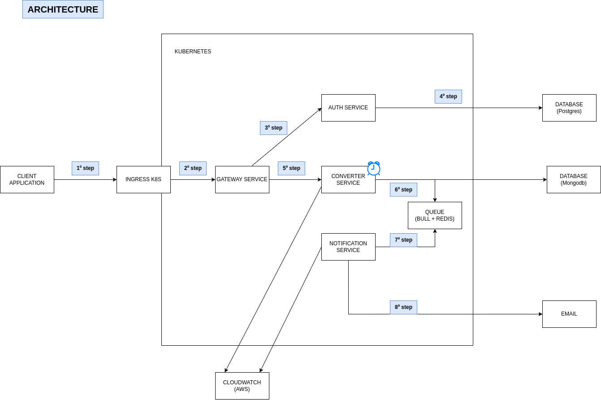

## ABOUT

The study project to learn more about microservices where the project has focus convert mp4 to mp3 file.

This project is a result the lecture https://www.youtube.com/watch?v=hmkF77F9TLw

## FEATURES 
- Convert mp4 to mp3 file.
- Notify via email mp3 file converted.
- Delete mp3 file converted after 30 days.

## TECHNOLOGIES

#### AUTH SERVICE
- Node.js
- Nest.js
- Typescript
- Postgresql
- Docker
- Docker compose
- Jest(unit tests)

#### CONVERTER SERVICE
- Node.js
- Nest.js
- Typescript
- Mongodb
- Docker
- Docker compose
- Jest(unit tests)
- Message queue(bull + redis)
- Cloudwatch(register logs the application)

#### NOTIFICATION SERVICE
- Node.js
- Nest.js
- Typescript
- Docker
- Docker compose
- Jest(unit tests)
- Message queue(bull + redis)
- Smtp(to send email)
- Cloudwatch(register logs the application)

#### GATEWAY SERVICE
- Node.js
- Javascript
- Express.js

## ARCHITECTURE

## INSTRUCTIONS TO RUN LOCALLY

#### AUTH SERVICE
- Clone project
- Access directory **auth**
- Create **.env** file based **.env.example** file
- Execute command **npm i** to install packages
- Execute command **docker-compose up -d** the application is running at http://localhost:3000

#### CONVERTER SERVICE
- Clone project
- Access directory **converter**
- Create **.env** file based **.env.example** file
- Execute command **npm i** to install packages
- Execute command **docker-compose up -d** the application is running at http://localhost:3002

#### NOTIFICATION SERVICE
- Clone project
- Access directory **notification**
- Create **.env** file based **.env.example** file
- Execute command **npm i** to install packages
- Execute command **docker-compose up -d** the application run

#### GATEWAY SERVICE
- Clone project
- Access directory **gateway**
- Create **.env** file based **.env.example** file
- Execute command **npm i** to install packages
- Execute all commands to run servies: **auth**, **converter** and **notification**.
- Execute command **docker-compose up -d** the application run at http://localhost:3001